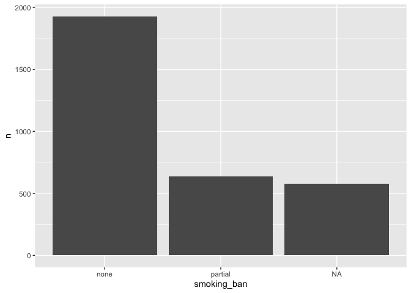
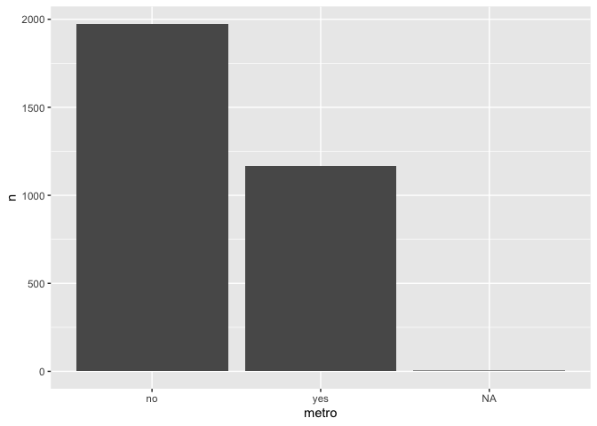
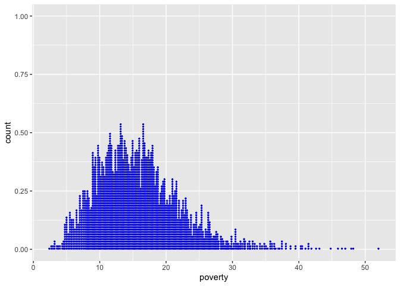
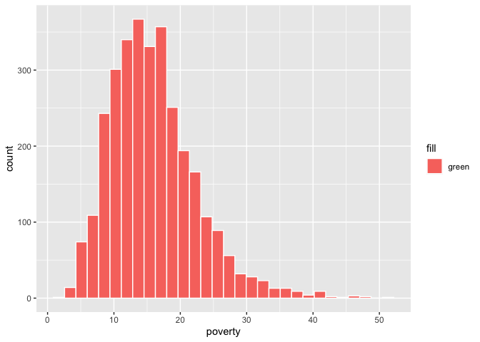
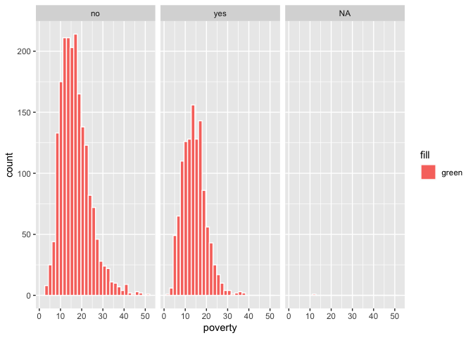
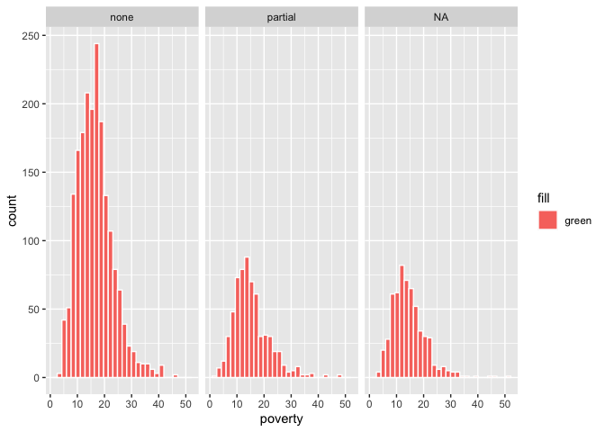
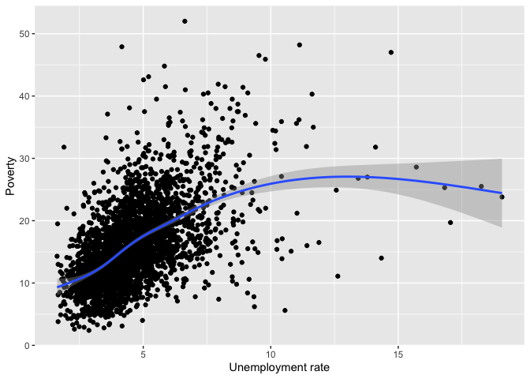
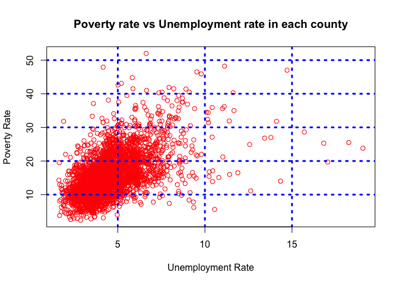

County
================
Tural Sadigov

# Load R data

``` r
load("county.rda")
```

# View only first few rows

``` r
library(tidyverse)
```

    ## ── Attaching packages ─────────────────────────────────────── tidyverse 1.3.2 ──
    ## ✔ ggplot2 3.3.6     ✔ purrr   0.3.4
    ## ✔ tibble  3.1.8     ✔ dplyr   1.0.9
    ## ✔ tidyr   1.2.0     ✔ stringr 1.4.0
    ## ✔ readr   2.1.2     ✔ forcats 0.5.1
    ## ── Conflicts ────────────────────────────────────────── tidyverse_conflicts() ──
    ## ✖ dplyr::filter() masks stats::filter()
    ## ✖ dplyr::lag()    masks stats::lag()

``` r
county <- as.tibble(county)
```

    ## Warning: `as.tibble()` was deprecated in tibble 2.0.0.
    ## Please use `as_tibble()` instead.
    ## The signature and semantics have changed, see `?as_tibble`.
    ## This warning is displayed once every 8 hours.
    ## Call `lifecycle::last_lifecycle_warnings()` to see where this warning was generated.

``` r
head(county)
```

    ## # A tibble: 6 × 15
    ##   name     state pop2000 pop2010 pop2017 pop_c…¹ poverty homeo…² multi…³ unemp…⁴
    ##   <fct>    <fct>   <dbl>   <dbl>   <int>   <dbl>   <dbl>   <dbl>   <dbl>   <dbl>
    ## 1 Autauga… Alab…   43671   54571   55504    1.48    13.7    77.5     7.2    3.86
    ## 2 Baldwin… Alab…  140415  182265  212628    9.19    11.8    76.7    22.6    3.99
    ## 3 Barbour… Alab…   29038   27457   25270   -6.22    27.2    68      11.1    5.9 
    ## 4 Bibb Co… Alab…   20826   22915   22668    0.73    15.2    82.9     6.6    4.39
    ## 5 Blount … Alab…   51024   57322   58013    0.68    15.6    82       3.7    4.02
    ## 6 Bullock… Alab…   11714   10914   10309   -2.28    28.5    76.9     9.9    4.93
    ## # … with 5 more variables: metro <fct>, median_edu <fct>,
    ## #   per_capita_income <dbl>, median_hh_income <int>, smoking_ban <fct>, and
    ## #   abbreviated variable names ¹​pop_change, ²​homeownership, ³​multi_unit,
    ## #   ⁴​unemployment_rate
    ## # ℹ Use `colnames()` to see all variable names

``` r
glimpse(county)
```

    ## Rows: 3,142
    ## Columns: 15
    ## $ name              <fct> Autauga County, Baldwin County, Barbour County, Bibb…
    ## $ state             <fct> Alabama, Alabama, Alabama, Alabama, Alabama, Alabama…
    ## $ pop2000           <dbl> 43671, 140415, 29038, 20826, 51024, 11714, 21399, 11…
    ## $ pop2010           <dbl> 54571, 182265, 27457, 22915, 57322, 10914, 20947, 11…
    ## $ pop2017           <int> 55504, 212628, 25270, 22668, 58013, 10309, 19825, 11…
    ## $ pop_change        <dbl> 1.48, 9.19, -6.22, 0.73, 0.68, -2.28, -2.69, -1.51, …
    ## $ poverty           <dbl> 13.7, 11.8, 27.2, 15.2, 15.6, 28.5, 24.4, 18.6, 18.8…
    ## $ homeownership     <dbl> 77.5, 76.7, 68.0, 82.9, 82.0, 76.9, 69.0, 70.7, 71.4…
    ## $ multi_unit        <dbl> 7.2, 22.6, 11.1, 6.6, 3.7, 9.9, 13.7, 14.3, 8.7, 4.3…
    ## $ unemployment_rate <dbl> 3.86, 3.99, 5.90, 4.39, 4.02, 4.93, 5.49, 4.93, 4.08…
    ## $ metro             <fct> yes, yes, no, yes, yes, no, no, yes, no, no, yes, no…
    ## $ median_edu        <fct> some_college, some_college, hs_diploma, hs_diploma, …
    ## $ per_capita_income <dbl> 27841.70, 27779.85, 17891.73, 20572.05, 21367.39, 15…
    ## $ median_hh_income  <int> 55317, 52562, 33368, 43404, 47412, 29655, 36326, 436…
    ## $ smoking_ban       <fct> none, none, partial, none, none, none, NA, NA, none,…

``` r
# summary in categorical variable
county %>% 
  count(smoking_ban)
```

    ## # A tibble: 3 × 2
    ##   smoking_ban     n
    ##   <fct>       <int>
    ## 1 none         1927
    ## 2 partial       635
    ## 3 <NA>          580

``` r
county %>% 
  count(smoking_ban) %>% 
  ggplot(aes(smoking_ban, n)) +
  geom_col()
```

<!-- -->

``` r
# summary in categorical variable
county %>% 
  count(smoking_ban, metro)
```

    ## # A tibble: 8 × 3
    ##   smoking_ban metro     n
    ##   <fct>       <fct> <int>
    ## 1 none        no     1202
    ## 2 none        yes     723
    ## 3 none        <NA>      2
    ## 4 partial     no      413
    ## 5 partial     yes     222
    ## 6 <NA>        no      359
    ## 7 <NA>        yes     220
    ## 8 <NA>        <NA>      1

``` r
county %>% 
  count(metro)
```

    ## # A tibble: 3 × 2
    ##   metro     n
    ##   <fct> <int>
    ## 1 no     1974
    ## 2 yes    1165
    ## 3 <NA>      3

``` r
county %>% 
  count(metro) %>% 
  ggplot(aes(metro, n)) +
  geom_col()
```

<!-- -->

``` r
# pull out variables/columns, but only first 10 elements
county %>% 
  select(pop2000, poverty, smoking_ban) %>% 
  slice(1:10)
```

    ## # A tibble: 10 × 3
    ##    pop2000 poverty smoking_ban
    ##      <dbl>   <dbl> <fct>      
    ##  1   43671    13.7 none       
    ##  2  140415    11.8 none       
    ##  3   29038    27.2 partial    
    ##  4   20826    15.2 none       
    ##  5   51024    15.6 none       
    ##  6   11714    28.5 none       
    ##  7   21399    24.4 <NA>       
    ##  8  112249    18.6 <NA>       
    ##  9   36583    18.8 none       
    ## 10   23988    16.1 none

``` r
county %>% 
  ggplot(aes(poverty)) +
  geom_dotplot(dotsize = 1, 
               binwidth = 1/5, 
               stackratio = 1.8, color = 'blue')
```

    ## Warning: Removed 2 rows containing non-finite values (stat_bindot).

<!-- -->

``` r
county %>% 
  ggplot(aes(poverty, fill = 'green')) +
  geom_histogram(color = 'white')
```

    ## `stat_bin()` using `bins = 30`. Pick better value with `binwidth`.

    ## Warning: Removed 2 rows containing non-finite values (stat_bin).

<!-- -->

``` r
county %>% 
  ggplot(aes(poverty, fill = 'green')) +
  geom_histogram(color = 'white') +
  facet_wrap(~metro)
```

    ## `stat_bin()` using `bins = 30`. Pick better value with `binwidth`.

    ## Warning: Removed 2 rows containing non-finite values (stat_bin).

<!-- -->

``` r
county %>% 
  ggplot(aes(poverty, fill = 'green')) +
  geom_histogram(color = 'white') +
  facet_wrap(~smoking_ban)
```

    ## `stat_bin()` using `bins = 30`. Pick better value with `binwidth`.

    ## Warning: Removed 2 rows containing non-finite values (stat_bin).

<!-- -->

``` r
county %>% 
  ggplot(aes(unemployment_rate, poverty)) +
  geom_point() +
  geom_smooth() +
  xlab('Unemployment rate') +
  ylab('Poverty') 
```

    ## `geom_smooth()` using method = 'gam' and formula 'y ~ s(x, bs = "cs")'

    ## Warning: Removed 3 rows containing non-finite values (stat_smooth).

    ## Warning: Removed 3 rows containing missing values (geom_point).

<!-- -->

``` r
county %>% 
  summarise()
```

    ## # A tibble: 1 × 0

``` r
# mean and median
mean(county$unemployment_rate, na.rm = T)
```

    ## [1] 4.611443

``` r
mean(county$poverty, na.rm = T)
```

    ## [1] 15.96885

``` r
median(county$unemployment_rate, na.rm = T)
```

    ## [1] 4.36

``` r
median(county$poverty, na.rm = T)
```

    ## [1] 15.2

``` r
attach(county)
# numerical summaries
summary(poverty, na.rm = T)
```

    ##    Min. 1st Qu.  Median    Mean 3rd Qu.    Max.    NA's 
    ##    2.40   11.30   15.20   15.97   19.40   52.00       2

``` r
# spread - IQR, sd, var
var(poverty)
```

    ## [1] NA

``` r
var(poverty, na.rm = T)
```

    ## [1] 42.45412

``` r
sd(poverty)
```

    ## [1] NA

``` r
sd(poverty, na.rm = T)
```

    ## [1] 6.515682

``` r
IQR(poverty, na.rm = T)
```

    ## [1] 8.1

``` r
# scatterpot - understanding two variables
plot(unemployment_rate, poverty, 
     main = 'Poverty rate vs Unemployment rate in each county',
     xlab = 'Unemployment Rate',
     ylab = 'Poverty Rate', col = 'red')
grid(lwd = 3, col = 'blue')
```

<!-- -->

``` r
# reading from CSV
county2 = read.csv('county.csv')
head(county2 == county)
```

    ##      name state pop2000 pop2010 pop2017 pop_change poverty homeownership
    ## [1,] TRUE  TRUE    TRUE    TRUE    TRUE       TRUE    TRUE          TRUE
    ## [2,] TRUE  TRUE    TRUE    TRUE    TRUE       TRUE    TRUE          TRUE
    ## [3,] TRUE  TRUE    TRUE    TRUE    TRUE       TRUE    TRUE          TRUE
    ## [4,] TRUE  TRUE    TRUE    TRUE    TRUE       TRUE    TRUE          TRUE
    ## [5,] TRUE  TRUE    TRUE    TRUE    TRUE       TRUE    TRUE          TRUE
    ## [6,] TRUE  TRUE    TRUE    TRUE    TRUE       TRUE    TRUE          TRUE
    ##      multi_unit unemployment_rate metro median_edu per_capita_income
    ## [1,]       TRUE              TRUE  TRUE       TRUE              TRUE
    ## [2,]       TRUE              TRUE  TRUE       TRUE              TRUE
    ## [3,]       TRUE              TRUE  TRUE       TRUE              TRUE
    ## [4,]       TRUE              TRUE  TRUE       TRUE              TRUE
    ## [5,]       TRUE              TRUE  TRUE       TRUE              TRUE
    ## [6,]       TRUE              TRUE  TRUE       TRUE              TRUE
    ##      median_hh_income smoking_ban
    ## [1,]             TRUE        TRUE
    ## [2,]             TRUE        TRUE
    ## [3,]             TRUE        TRUE
    ## [4,]             TRUE        TRUE
    ## [5,]             TRUE        TRUE
    ## [6,]             TRUE        TRUE
