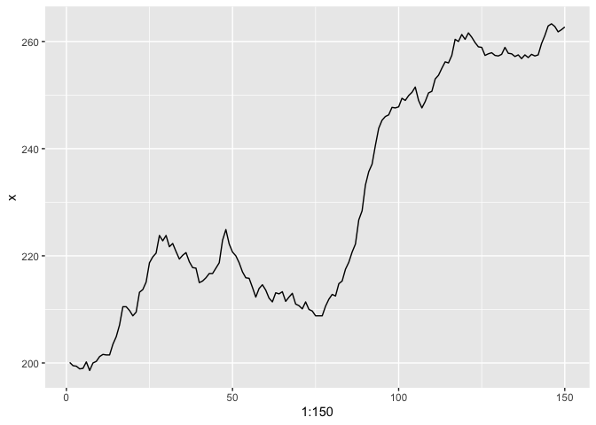
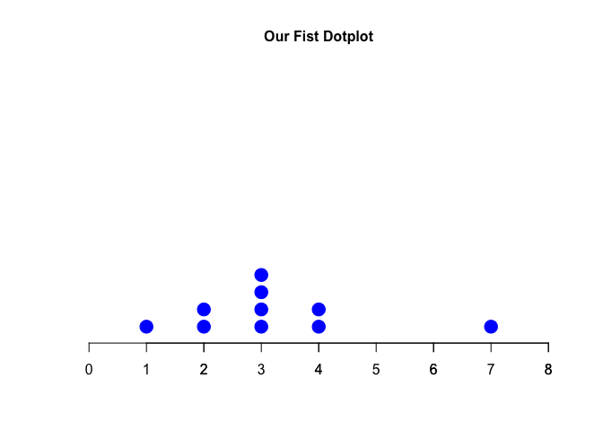
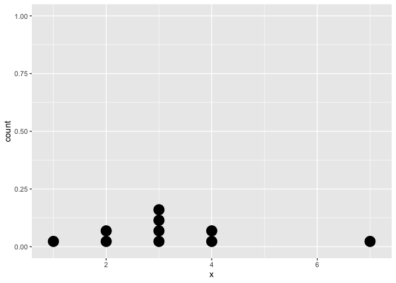

Introduction to R
================
Tural Sadigov
2022-08-09

# R as calculator.

``` r
3+4
```

    ## [1] 7

``` r
3*4
```

    ## [1] 12

``` r
3^4
```

    ## [1] 81

``` r
3/4
```

    ## [1] 0.75

``` r
sin(0)
```

    ## [1] 0

# Variables

``` r
x = 5
print(x)
```

    ## [1] 5

``` r
x <- 7
print(x)
```

    ## [1] 7

``` r
x
```

    ## [1] 7

# Strings

``` r
x = 'the best class ever'
x
```

    ## [1] "the best class ever"

# Pointwise operations on arrays

``` r
x = c(4,7,2,3)
x
```

    ## [1] 4 7 2 3

``` r
x^2
```

    ## [1] 16 49  4  9

``` r
x*x
```

    ## [1] 16 49  4  9

``` r
sum(x)
```

    ## [1] 16

``` r
prod(x)
```

    ## [1] 168

``` r
length(x)
```

    ## [1] 4

``` r
mean(x)
```

    ## [1] 4

``` r
y = c(1, 2, -3, 0.5)
x*y
```

    ## [1]  4.0 14.0 -6.0  1.5

``` r
x+y
```

    ## [1]  5.0  9.0 -1.0  3.5

``` r
x^y
```

    ## [1]  4.000000 49.000000  0.125000  1.732051

# BJ dataset in R

``` r
BJsales
```

    ## Time Series:
    ## Start = 1 
    ## End = 150 
    ## Frequency = 1 
    ##   [1] 200.1 199.5 199.4 198.9 199.0 200.2 198.6 200.0 200.3 201.2 201.6 201.5
    ##  [13] 201.5 203.5 204.9 207.1 210.5 210.5 209.8 208.8 209.5 213.2 213.7 215.1
    ##  [25] 218.7 219.8 220.5 223.8 222.8 223.8 221.7 222.3 220.8 219.4 220.1 220.6
    ##  [37] 218.9 217.8 217.7 215.0 215.3 215.9 216.7 216.7 217.7 218.7 222.9 224.9
    ##  [49] 222.2 220.7 220.0 218.7 217.0 215.9 215.8 214.1 212.3 213.9 214.6 213.6
    ##  [61] 212.1 211.4 213.1 212.9 213.3 211.5 212.3 213.0 211.0 210.7 210.1 211.4
    ##  [73] 210.0 209.7 208.8 208.8 208.8 210.6 211.9 212.8 212.5 214.8 215.3 217.5
    ##  [85] 218.8 220.7 222.2 226.7 228.4 233.2 235.7 237.1 240.6 243.8 245.3 246.0
    ##  [97] 246.3 247.7 247.6 247.8 249.4 249.0 249.9 250.5 251.5 249.0 247.6 248.8
    ## [109] 250.4 250.7 253.0 253.7 255.0 256.2 256.0 257.4 260.4 260.0 261.3 260.4
    ## [121] 261.6 260.8 259.8 259.0 258.9 257.4 257.7 257.9 257.4 257.3 257.6 258.9
    ## [133] 257.8 257.7 257.2 257.5 256.8 257.5 257.0 257.6 257.3 257.5 259.6 261.1
    ## [145] 262.9 263.3 262.8 261.8 262.2 262.7

``` r
help("BJsales")
help(BJsales)
```

# Choosing sample from set

``` r
x
```

    ## [1] 4 7 2 3

``` r
set.seed(123)
sample(x,2)
```

    ## [1] 2 3

``` r
sample(BJsales, 10)
```

    ##  [1] 203.5 220.7 260.0 216.7 262.7 261.8 233.2 235.7 259.6 237.1

# Time plot of the data using tidyverse

``` r
library(tidyverse)
```

    ## ── Attaching packages ─────────────────────────────────────── tidyverse 1.3.2 ──
    ## ✔ ggplot2 3.3.6     ✔ purrr   0.3.4
    ## ✔ tibble  3.1.8     ✔ dplyr   1.0.9
    ## ✔ tidyr   1.2.0     ✔ stringr 1.4.0
    ## ✔ readr   2.1.2     ✔ forcats 0.5.1
    ## ── Conflicts ────────────────────────────────────────── tidyverse_conflicts() ──
    ## ✖ dplyr::filter() masks stats::filter()
    ## ✖ dplyr::lag()    masks stats::lag()

``` r
BJsales_df <- as.tibble(BJsales)
```

    ## Warning: `as.tibble()` was deprecated in tibble 2.0.0.
    ## Please use `as_tibble()` instead.
    ## The signature and semantics have changed, see `?as_tibble`.
    ## This warning is displayed once every 8 hours.
    ## Call `lifecycle::last_lifecycle_warnings()` to see where this warning was generated.

``` r
BJsales_df %>% 
  ggplot(aes(1:150,x))+
  geom_line()
```

    ## Don't know how to automatically pick scale for object of type ts. Defaulting to continuous.

<!-- -->

# Dotplot using base R

``` r
x = c(4,7,2,3, 3,3,3,4,2,1)
# introduce the following plot step by step
stripchart(x,  method = 'stack', 
           at = 0.05, pch = 20, xlim = c(0,8),
           col = 'blue', cex = 3, frame.plot = F,
           main = 'Our Fist Dotplot', cex.main = 1)
axis(1, at = seq(1, 8, by = 1))
```

<!-- -->

# Dotplot using tiidyverse/ggplot

``` r
x = c(4,7,2,3, 3,3,3,4,2,1)
df = as.tibble(x)
df %>% 
  ggplot(aes(x)) +
  geom_dotplot()
```

    ## Bin width defaults to 1/30 of the range of the data. Pick better value with `binwidth`.

<!-- -->
